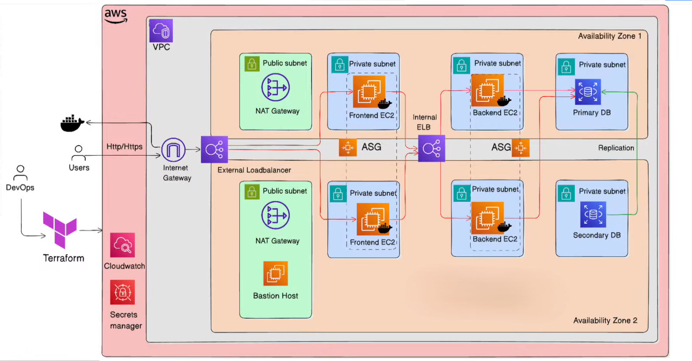
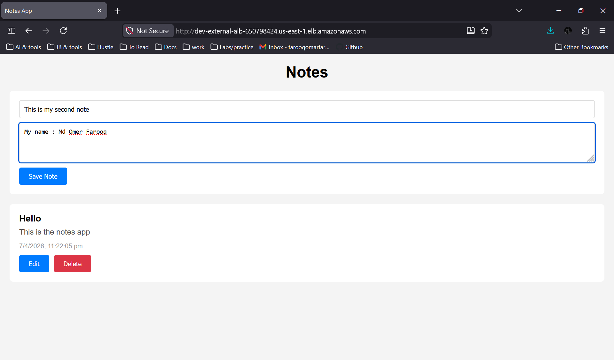
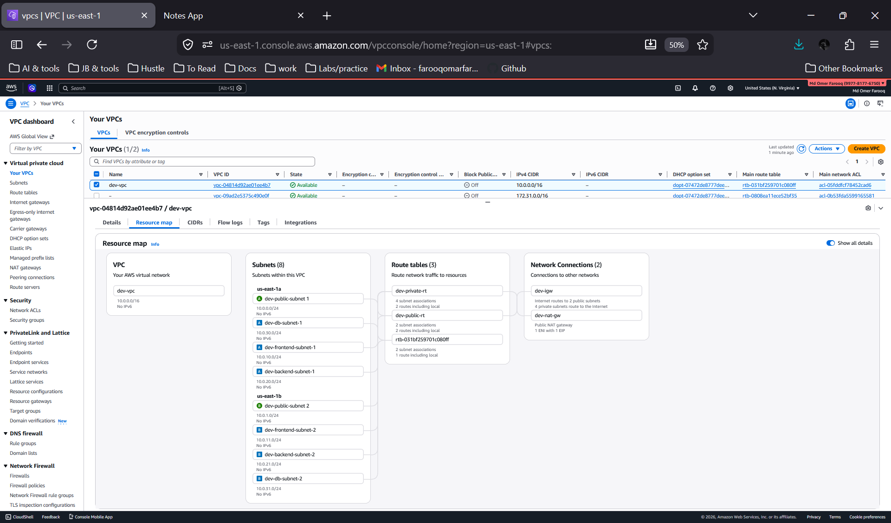
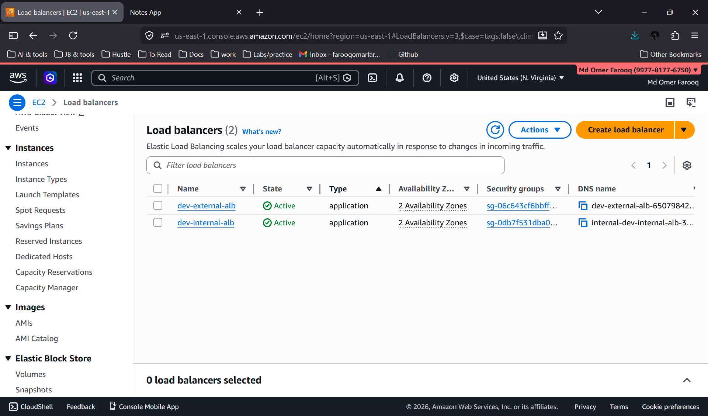
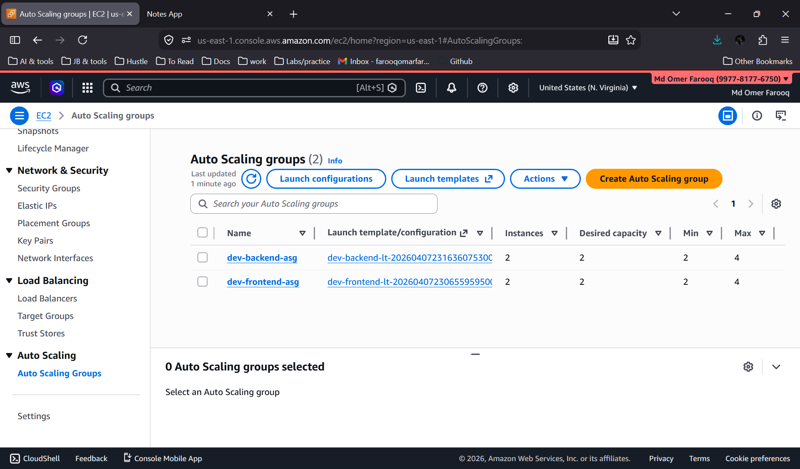
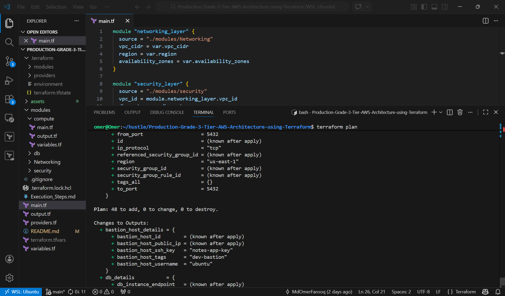
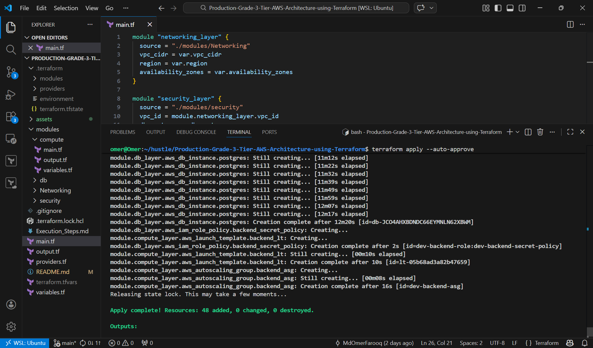

# 3-Tier AWS Architecture using Terraform (Multi-Environment Ready) 


This project provisions a **production-style 3-tier architecture on AWS using Terraform**, with a key focus on modular design, high availability, and automated application deployment.

## What This Project Does:

This setup creates a complete infrastructure stack:

- VPC with public and private subnets across multiple AZs  
- Internet Gateway and NAT Gateways  
- Bastion Host for secure SSH access  
- External Application Load Balancer (traffic entry point)  
- Frontend tier (Auto Scaling EC2 running containers from ECR) 
- Internal Load Balancer for backend EC2 instances 
- Backend tier (Auto Scaling EC2 behind internal load balancer)  
- Database layer (Primary + Secondary for high availability)  
- AWS Secrets Manager for securely storing and auto-rotating database credentials


## Architecture Overview:

<p align="center">
  
</p>

## 🚀 Deployment Overview

### Application Running



### Network Architecture



### Load Balancer



### Auto Scaling




<details>
<summary>Terraform Plan & Apply Output</summary>




</details>


## Architecture Layers

The system is divided into three layers:

### 1. Public Layer (Public Subnets)
- External Load Balancer receives HTTP traffic  
- Bastion Host for administrative access  
- NAT Gateways for outbound internet access for ec2 instances from private subnets  

### 2. Application Layer 
- **Frontend EC2 (ASG)**  (Private subnets across multiple AZs)
  - Pulls Docker image from ECR on startup  
  - Serves client requests  
  - Communicates with backend services via internal load balancer

- **Backend EC2 (ASG)**  (Private subnets across multiple AZs)
  - Runs API services  
  - Accessible only via internal load balancer  

### 3. Database Layer (Private Subnets)
- Primary DB (write operations)  
- Secondary DB (replication for high availability)  

## State Management
Terraform state is stored in an S3 bucket with state locking to prevent concurrent modifications. This allows for safe collaboration and ensures that the infrastructure state is consistent across different environments (dev, staging, prod).

## Environment Management (Workspaces)
This project uses **Terraform Workspaces** to maintain separate state files for different environments using the same codebase. This allows you to easily switch between environments (e.g., dev, staging, prod) without changing your Terraform configuration. Each workspace will have its own state file in the S3 bucket, ensuring that resources are managed independently for each environment.

## Execution Steps

Detailed setup and deployment steps are available here:  
[Execution Guide](./Execution_Steps.md)

### Application Source Code

The application used in this architecture is available here:  
https://github.com/MdOmerFarooq/notes-app

It contains the Dockerfiles and instructions to build and push images to ECR.

## How Application Deployment Works

Whenever a new EC2 instance is launched by the Auto Scaling Groups, a user data script:

1. Installs Docker  
2. Authenticates with AWS ECR (via IAM role)  
3. Pulls the latest container image  
4. Runs the container automatically  

Example flow:

```bash
    #!/bin/bash
    set -e
    apt-get update -y
    apt-get install -y docker.io awscli
    systemctl start docker
    systemctl enable docker
    aws ecr get-login-password --region ${var.aws_region} | \
      docker login --username AWS --password-stdin ${var.ecr_registry_url}
    docker pull ${var.ecr_registry_url}/notes-frontend:latest
    docker run -d \
      --restart always \
      -p 80:80 \
      -e BACKEND_URL=http://${var.internal_alb_dns} \
      ${var.ecr_registry_url}/notes-frontend:latest
```
This ensures that any new EC2 instance launched by the Auto Scaling Groups will automatically have the application up and running without manual intervention.

The backend app is also designed to create a connection to the RDS database using credentials stored in AWS Secrets Manager, which are injected as environment variables into the container and also creates a table in the database on startup if it doesn't exist.

### 🔐 Security & Best Practices

- EC2 instances use IAM Roles (no access keys)
- Backend and database run in private subnets
- Bastion host used for controlled administrative access
- Terraform state stored in S3 with encryption and versioning
- State locking implemented via s3 backend to prevent concurrent modifications
- Database credentials managed and rotated using AWS Secrets Manager

## Maintained by: Omer Farooq
LinkedIn: https://www.linkedin.com/in/mdomerfarooq/

## Contact
For any questions, feedback, or collaboration:
Email: farooqomarfarooqomar@gmail.com
